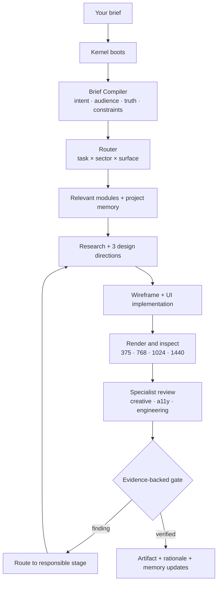
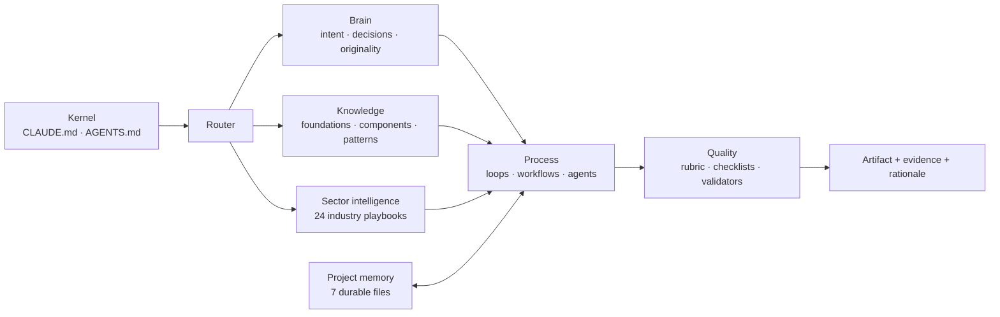
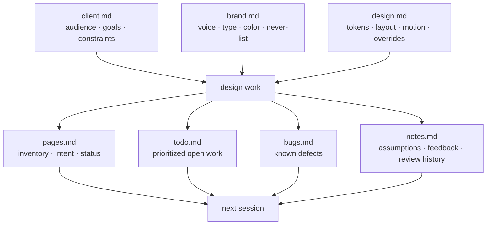
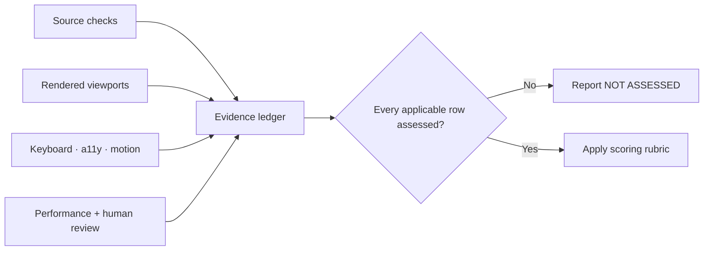

<div align="center">

<picture>
  <source media="(prefers-color-scheme: dark)" srcset="press/logo-dark.svg">
  
</picture>

### The Design Intelligence Operating System for AI Coding Agents

**Your AI agent writes flawless code. Now teach it taste.**

*Claude · Cursor · Copilot · Windsurf · Cline · Aider — any agent. One prompt in, Stripe-grade UI out.*

[](https://github.com/ardamoustafa1/DesignOS/stargazers)
[](LICENSE)
[](CHANGELOG.md)
[](https://github.com/ardamoustafa1/DesignOS/actions/workflows/proof.yml)
[](https://github.com/ardamoustafa1/DesignOS/actions/workflows/validate.yml)
[](checklists/accessibility.md)
[](SECURITY.md)
[](.claude-plugin/plugin.json)
[](industries/)
[](CONTRIBUTING.md)


[**Get started**](#-quick-start) · [How it works](#-how-it-works) · [Architecture](ARCHITECTURE.md) · [Enterprise guide](ENTERPRISE.md) · [Governance](GOVERNANCE.md) · [Before/After demo](website/before-after.html) · [Live showcase](examples/README.md) · [Measured results](evals/RESULTS.md) · [The Museum](museum/README.md)

[Türkçe](README.tr.md) · [中文](README.zh.md) · [Español](README.es.md) · [日本語](README.ja.md) · [Deutsch](README.de.md) · [Français](README.fr.md) · [Português](README.pt.md)

<sub>Translations are LLM-authored, unreviewed by native speakers — corrections welcome via PR.</sub>

</div>

---

## Start here

DesignOS is a repository-native design intelligence layer for AI coding agents. It adds
the part a code model usually lacks: a repeatable way to understand the brief, derive a
distinct visual direction, select relevant design knowledge, inspect the rendered result,
and remember decisions across sessions.

It is not a component library and it does not replace your framework. It sits beside your
codebase as Markdown instructions, specialist roles, workflows, validators, and a small
zero-dependency CLI.

> **The short version:** install once, verify the connection, then describe the interface
> you want. DesignOS routes the task through the right modules and leaves an inspectable
> trail of decisions, findings, and project memory.

### What changes after installation?

| Without a design operating system | With DesignOS |
|---|---|
| The agent jumps from request to JSX | The brief becomes a testable design contract first |
| “Premium” becomes gradients and cards | Visual direction is derived from product material and brand belief |
| Every session starts from zero | Seven memory files preserve brand and system decisions |
| The author grades its own work informally | Specialist review, static checks, and an evidence ledger separate creation from verification |
| Happy-path mockups look finished | Loading, empty, error, success, keyboard, responsive, and reduced-motion states are considered |
| References become style imitation | DesignOS transfers tactics while prohibiting branded motifs |

<details>
<summary><b>Table of contents</b></summary>

- [Quick Start](#-quick-start)
- [Choose your agent](#choose-your-agent)
- [Create your first interface](#create-your-first-interface)
- [How It Works](#-how-it-works)
- [System architecture](#system-architecture)
- [Project memory](#project-memory)
- [CLI reference](#cli-reference)
- [Quality and evidence](#quality-and-evidence)
- [Examples and starters](#examples-and-starters)
- [Troubleshooting](#troubleshooting)
- [Community](#community)

</details>

---

## ⚡ Quick Start

### Fastest path — Claude Code plugin (two commands)

Inside any Claude Code session:

```text
/plugin marketplace add ardamoustafa1/DesignOS
/plugin install designos@designos
```

The `designos` skill then activates automatically on any UI/design request — no slash
command needed. It routes through the kernel, loads only the relevant modules, and runs
the deterministic gate before any score claim.

### Full install — repository-native (all agents + CLI)

Run the installer from the root of the project you want DesignOS to guide — not from
inside a DesignOS clone.

```bash
cd path/to/your-project
npx github:ardamoustafa1/DesignOS init --agents --skills
```

The installer creates a local `./DesignOS` copy, connects the Claude kernel, and optionally
installs the nine specialist agents and four `/design-*` commands.

```text
your-project/
├── DesignOS/                 design knowledge, workflows, CLI, validators
├── CLAUDE.md                 imports @DesignOS/CLAUDE.md
├── .claude/
│   ├── agents/               9 specialist roles
│   └── commands/             /design-brief · /design-review · /design-score · /design-tokens
└── your existing app files   untouched by installation
```

### 2. Verify the connection

All commands after installation use the local CLI copy:

```bash
node DesignOS/bin/designos.js doctor
```

A healthy setup confirms the kernel, local CLI, import, agents, skills, and project-memory
status. If your agent is not Claude Code, export its native rules file next.

> [!WARNING]
> Never run bare `npx designos ...`. That npm name belongs to an unrelated package.
> Use the GitHub installer once, then always use `node DesignOS/bin/designos.js ...`.

### 3. Give it a real brief

```text
Design a pricing page for a cybersecurity SaaS.

Audience: security leaders comparing vendors before a technical evaluation.
Primary action: book a technical demo.
Product material: risk timeline, asset table, and investigation workflow.
Proof available: real dashboard screenshots; no customer logos yet.
Tone: calm, precise, high-trust. Dark theme, but no neon cyber clichés.
Stack: use the existing project stack and tokens.
```

A strong brief gives DesignOS material to derive from. If details are missing, the
[Brief Compiler](brain/brief-compiler.md) asks only high-impact questions or records
explicit assumptions instead of silently inventing facts.

### 4. Review the result

```bash
node DesignOS/bin/designos.js audit src/
node DesignOS/bin/designos.js review src/ --fix-prompt --no-fail
node DesignOS/bin/designos.js visual path/to/page.html --no-fail
node DesignOS/bin/designos.js report src/ --no-fail
```

`review` reports static source risks. It is intentionally not presented as proof of
visual quality, WCAG conformance, performance, or conversion. Final claims require the
[evidence ledger](workflows/final-gate.md).

---

## Choose your agent

The knowledge system is shared; the connection step differs by tool.

| Agent | After `init` | What it creates | Capability |
|---|---|---|---|
| Claude Code | Nothing else required | `CLAUDE.md`, specialist agents, slash commands | Full kernel + native subagents/commands |
| Codex, Gemini CLI, Amp, Zed, Jules | `export agentsmd` | `AGENTS.md` | Kernel through the agents.md convention |
| Cursor | `export cursor` | `.cursorrules` | Kernel rules in project context |
| GitHub Copilot | `export copilot` | `.github/copilot-instructions.md` | Repository instructions |
| Windsurf | `export windsurf` | `.windsurfrules` | Workspace rules |
| Cline | `export cline` | `.clinerules` | Project rules |
| Aider | `export aider` | `CONVENTIONS.md` | Repository conventions |

```bash
# Choose one, or generate every supported rules file:
node DesignOS/bin/designos.js export agentsmd
node DesignOS/bin/designos.js export cursor
node DesignOS/bin/designos.js export copilot
node DesignOS/bin/designos.js export windsurf
node DesignOS/bin/designos.js export cline
node DesignOS/bin/designos.js export aider
node DesignOS/bin/designos.js export all
```

Existing non-DesignOS rules files are protected by default. The exporter warns instead of
overwriting them; review [the integration guide](integrations/README.md) before using
`--force`.

<details>
<summary><b>Manual installation</b></summary>

```bash
git clone https://github.com/ardamoustafa1/DesignOS.git
cd path/to/your-project
cp -r path/to/DesignOS ./DesignOS
echo "@DesignOS/CLAUDE.md" >> CLAUDE.md

# Optional Claude Code integrations
cp DesignOS/agents/*.md .claude/agents/
cp DesignOS/skills/design-*.md .claude/commands/
```

Run `node DesignOS/bin/designos.js doctor` afterwards. For non-Claude agents, use the
appropriate export command rather than hand-copying the kernel.

</details>

<details>
<summary><b>Global installation</b></summary>

```bash
cp -r path/to/DesignOS ~/.claude/DesignOS
echo "@~/.claude/DesignOS/CLAUDE.md" >> ~/.claude/CLAUDE.md
```

Local project installation is recommended when teams need versioned, reproducible rules.

</details>

---

## Create your first interface

There are three good entry points. Pick the one that matches how much you already know.

### A. Ask naturally

```text
Build a premium landing page for an AI incident-response product.
Use our existing stack. The hero must show the real investigation timeline.
Primary action is starting a sandbox. Do not invent logos, metrics, or compliance claims.
Run the full DesignOS loop and show what was not verified.
```

### B. Generate a structured brief

```bash
node DesignOS/bin/designos.js brief --interactive
```

Or create one non-interactively:

```bash
node DesignOS/bin/designos.js brief \
  --type pricing \
  --industry fintech \
  --audience "finance operations leaders" \
  --goal "start a guided trial" \
  --tone "precise, calm, evidence-first" \
  --constraints "existing React stack, light theme, WCAG 2.2 AA target"
```

### C. Use a ready-made recipe

Start from [recipes](recipes/README.md) for common surfaces:

- [Stripe-level landing page](recipes/stripe-level-landing.md)
- [SaaS pricing page](recipes/saas-pricing-page.md)
- [Admin dashboard](recipes/admin-dashboard.md)
- [Mobile onboarding](recipes/mobile-onboarding.md)
- [Investor demo page](recipes/investor-demo-page.md)

Each recipe is a high-signal brief, not an alternate mini-kernel. It still boots the same
DesignOS process, originality discipline, render inspection, and evidence rules.

---

## 🔍 How It Works

DesignOS makes the design process observable. One request moves through a fixed control
flow; findings return to the stage that caused them.



### The loop, stage by stage

| Stage | Question answered | Concrete output |
|---|---|---|
| Contract | What must this cause, for whom, using what truth? | Intent, audience state, proof/assets, never-list, acceptance evidence |
| Directions | What could make this product unmistakable? | Material-led, audience-led, and belief-led hypotheses |
| Wireframe | In what order should attention move? | Section structure, eye path, primary action, responsive priorities |
| UI | What system expresses that hierarchy? | Tokens, type, spacing, components, states, motion |
| Render/Inspect | Does the real artifact match the source-code intention? | Viewport evidence, visual findings, corrected implementation |
| Specialist review | Is it coherent, usable, accessible, fast, and truthful? | Findings with owner and severity |
| Final Gate | What was actually checked? | Static risk output + evidence ledger + NOT ASSESSED disclosures |
| Memory | What must the next session remember? | Durable decisions, status, bugs, and open work |

Read the complete contracts in [the Design Loop](loops/design-loop.md) and the
[Final Gate](workflows/final-gate.md).

---

## System architecture

DesignOS uses a small kernel and lazy-loads detailed modules only when they change a
decision. This keeps the agent focused instead of flooding its context with every rule.



### The seven layers

| Layer | Responsibility | Explore |
|---|---|---|
| Kernel | Boot order, routing table, non-negotiable standards | [CLAUDE.md](CLAUDE.md) · [AGENTS.md](AGENTS.md) |
| Design brain | Intent, decision rules, taste, originality, reference transfer | [brain](brain/) |
| Knowledge | Foundations, components, patterns, motion, psychology, native UI | [foundations](foundations/) · [components](components/) · [patterns](patterns/) |
| Sector intelligence | Buyer psychology, trust requirements, visual licenses | [industries](industries/) |
| Process | Design/review loops, workflows, and specialist roles | [loops](loops/) · [workflows](workflows/) · [agents](agents/) |
| Memory | Brand, system, pages, tasks, bugs, notes | [memory](memory/) |
| Evidence | Rubric, checklists, static validators, eval protocol | [scoring](scoring/) · [checklists](checklists/) · [validators](validators/) · [evals](evals/) |

<details>
<summary><b>Repository map</b></summary>

```text
DesignOS/
├── CLAUDE.md · AGENTS.md       kernel and routing
├── brain/                       design reasoning and originality
├── foundations/                color, type, spacing, layout, tokens, a11y
├── components/                 UI component intelligence
├── patterns/                   page and flow patterns
├── psychology/                 attention, persuasion, trust, cognition
├── motion/ · native/           motion and platform-native guidance
├── industries/                 24 sector playbooks
├── agents/                     9 specialist roles
├── loops/ · workflows/         production and review processes
├── scoring/ · checklists/      review rubric and evidence requirements
├── validators/                 zero-dependency static checks
├── memory/                     protocol, templates, personality packs
├── references/ · goldens/      reference tactics and target bars
├── starter/ · recipes/         executable starting points
├── examples/ · website/        inspectable demonstrations
├── evals/ · case-studies/      measurement and field evidence
└── bin/designos.js             installer and local CLI
```

</details>

---

## Project memory

Without memory, every new chat can quietly change the brand, spacing scale, terminology,
or page goals. DesignOS persists the reasoning, not only the final values.



Bootstrap the seven files from [memory/templates](memory/templates/) and follow the
[memory protocol](memory/README.md): decisions carry reasons, dates are absolute,
overrides are explicit, and superseded reasoning is preserved instead of erased.

---

## CLI reference

Every command runs from your project root after installation.

| Command | Purpose | Writes files? |
|---|---|---:|
| `doctor` | Verify kernel, CLI, integrations, skills, and memory | No |
| `export <agent>` | Generate the selected agent's rules file | Yes |
| `brief` | Produce a structured, agent-ready design brief | Optional |
| `suggest <brief>` | Deterministic design-system recommendation: sector + surface routing, contrast-verified palette (ratios computed at output time), type pairing, anti-patterns | No |
| `starter <name> <dir>` | Copy a production-oriented starter | Yes |
| `audit <target>` | Run token-drift, accessibility-basics, and token-pair contrast validators | No |
| `review <target>` | Report static design risks; optionally create a fix prompt | No |
| `visual <target>` | Create screenshot/static visual QA evidence | Yes |
| `elevate <target>` | Generate a premium-refactor prompt | Yes |
| `report <target>` | Create a delivery report and sign-off ledger | Yes |
| `eval <slug>` | Scaffold a controlled evaluation run | Yes |
| `case <slug>` | Scaffold a case study and showcase entry | Yes |

```bash
node DesignOS/bin/designos.js doctor
node DesignOS/bin/designos.js export all
node DesignOS/bin/designos.js brief --interactive
node DesignOS/bin/designos.js starter landing-page my-launch
node DesignOS/bin/designos.js audit src/
node DesignOS/bin/designos.js review src/ --fix-prompt --no-fail
node DesignOS/bin/designos.js visual index.html --no-fail
node DesignOS/bin/designos.js elevate src/ --no-fail
node DesignOS/bin/designos.js report src/ --no-fail
node DesignOS/bin/designos.js eval cursor-pricing --agent Cursor --brief B-001
node DesignOS/bin/designos.js case acme-pricing --project "Acme Pricing" --url https://example.com
```

Run `node DesignOS/bin/designos.js help` for flags and usage. The CLI has no runtime
dependencies beyond Node.js 18+.

---

## Quality and evidence

DesignOS reviews seven dimensions. The written rubric sets the quality language; the
evidence ledger records which checks actually happened.

| Dimension | What the reviewer attacks | Typical evidence |
|---|---|---|
| UI Craft | Type, spacing, color, alignment, tokens, detail consistency | Source inspection + rendered viewports |
| UX & Flow | Eye path, cognitive load, conventions, state completeness | Flow walk + responsive/state evidence |
| Accessibility | Contrast, keyboard, semantics, reflow, announcements, motion | Tools + manual keyboard/tree checks |
| Performance | LCP, CLS, INP, payloads, fonts, images, animation cost | Lighthouse/CWV measurement |
| Modernity | Current craft without trend cosplay | Reference comparison + creative review |
| Conversion | Claim, mechanism, proof, objections, ask, friction, honesty | Content/proof audit + task completion |
| Brand Fit & Distinctiveness | Product derivation, signature, swap resistance | Derivation chain + logo-swap/recall review |



> [!IMPORTANT]
> A clean static `review` result means the configured source-risk checks found nothing.
> It does not by itself prove WCAG conformance, visual excellence, Lighthouse scores, or
> conversion performance. Read [Proof Standard](PROOF_STANDARD.md), [Final Gate](workflows/final-gate.md),
> and [Known Limitations](LIMITATIONS.md) before publishing a quality claim.

### What is mechanically checked today?

- token drift and off-grid spacing risks
- common semantic and accessible-name mistakes
- missing landmarks/headings and suspicious focus removal
- raw color usage outside token/exception boundaries
- common fake-proof and hard-compliance claim risks
- thin state coverage heuristics
- optional browser screenshots and basic overflow/render checks

The complete design review remains broader than these static checks. Unverified dimensions
stay **NOT ASSESSED** rather than becoming an invented score.

---

## Examples and starters

### See the system applied

| Resource | What to inspect |
|---|---|
| [Before / After](website/before-after.html) | The same brief with visible anti-pattern annotations |
| [Live showcase](examples/README.md) | Landing, dashboard, pricing, and docs on one token system |
| [Landing walkthrough](examples/saas-landing-walkthrough.md) | Decisions and failures behind the landing page |
| [Dashboard walkthrough](examples/dashboard-walkthrough.md) | Density, hierarchy, tables, charts, and states |
| [Pricing walkthrough](examples/pricing-walkthrough.md) | Plan choice, trust, proof, and conversion logic |
| [Docs walkthrough](examples/docs-walkthrough.md) | Information architecture and developer experience |
| [Goldens](goldens/README.md) | Target bars for premium output categories |
| [Anti-Pattern Museum](museum/README.md) | Recognizable design failures and preventing rules |

### Start with working files

```bash
node DesignOS/bin/designos.js starter list
node DesignOS/bin/designos.js starter landing-page my-launch
node DesignOS/bin/designos.js starter next-saas my-app
node DesignOS/bin/designos.js starter react-dashboard operations-console
node DesignOS/bin/designos.js starter docs-site developer-docs
node DesignOS/bin/designos.js starter mobile-app mobile-onboarding
```

Browse [all starters](starter/README.md), [copy-ready recipes](recipes/README.md),
[visual reference packs](references/README.md), and the one-page [cheatsheet](CHEATSHEET.md).

---

## Troubleshooting

<details>
<summary><b>The agent ignores DesignOS</b></summary>

Run `doctor`. Confirm the correct rules file exists for your agent and that `./DesignOS`
has not been moved. For Claude Code, `CLAUDE.md` must contain `@DesignOS/CLAUDE.md`.

</details>

<details>
<summary><b>The output still looks generic</b></summary>

Give the brief product material, real assets, a brand belief, and a never-list. Ask the
agent to show the three design directions before implementation and name the chosen
signature's derivation chain. See [Brief Compiler](brain/brief-compiler.md) and
[Originality](brain/originality.md).

</details>

<details>
<summary><b>The CLI says the target does not exist</b></summary>

Run commands from the project root and pass a path relative to that root. `review` accepts
supported UI source files or directories; `visual` expects an HTML file or URL.

</details>

<details>
<summary><b>An export would overwrite my existing rules</b></summary>

DesignOS protects non-generated rules files. Merge the instructions intentionally or back
up the file before using `--force`. See [integrations](integrations/README.md).

</details>

<details>
<summary><b>I accidentally ran npx designos</b></summary>

That package is unrelated. Review any changes it made, then reinstall with
`npx github:ardamoustafa1/DesignOS init --agents --skills` and use the local Node command.

</details>

For a longer onboarding and diagnostic guide, read [Getting Started](GETTING-STARTED.md).

---

## Community

DesignOS becomes more credible through inspectable work, independent runs, and challenged
rules — not through louder claims.

- Star the repository so other builders can find it.
- Add real work to the [Showcase](SHOWCASE.md).
- Submit an independent result using the [evaluation protocol](evals/README.md).
- Challenge or sharpen a rule through [Contributing](CONTRIBUTING.md).
- Share a real adoption story using the [case-study template](case-studies/TEMPLATE.md).
- Join [Discussions](DISCUSSIONS.md) for questions, show-and-tell, and module proposals.

Project guides: [Roadmap](ROADMAP.md) · [Security](SECURITY.md) ·
[Enterprise](ENTERPRISE.md) · [Governance](GOVERNANCE.md) ·
[Code of Conduct](CODE_OF_CONDUCT.md) · [Press kit](press/README.md)

---

## License

MIT — see [LICENSE](LICENSE). Use it, fork it, adapt it, and document what you learn.

<div align="center">

**Build interfaces that can explain every decision.**

<sub>DesignOS is open source. The strongest contribution is evidence from real use.</sub>

</div>
