<div align="center">

<picture>
  <source media="(prefers-color-scheme: dark)" srcset="press/logo-dark.svg">
  
</picture>

### The Design Intelligence Operating System for AI Coding Agents

**Your AI agent writes flawless code. Now teach it taste.**

*Claude · Cursor · Copilot · Windsurf · Cline · Aider — any agent. One prompt in, Stripe-grade UI out.*

[](https://github.com/ardamoustafa1/DesignOS/stargazers)
[](LICENSE)
[](CHANGELOG.md)
[](https://github.com/ardamoustafa1/DesignOS/actions/workflows/proof.yml)
[](https://github.com/ardamoustafa1/DesignOS/actions/workflows/validate.yml)
[](checklists/accessibility.md)
[](SECURITY.md)
[](CONTRIBUTING.md)



[**Get started**](#-quick-start) · [How it works](#-how-it-works) · [Architecture](ARCHITECTURE.md) · [Enterprise guide](ENTERPRISE.md) · [Governance](GOVERNANCE.md) · [Before/After demo](website/before-after.html) · [Live showcase](examples/README.md) · [Measured results](evals/RESULTS.md) · [The Museum](museum/README.md)

[Türkçe](README.tr.md) · [中文](README.zh.md) · [Español](README.es.md) · [日本語](README.ja.md) · [Deutsch](README.de.md) · [Français](README.fr.md) · [Português](README.pt.md)

<sub>Translations are LLM-authored, unreviewed by native speakers — corrections welcome via PR.</sub>

</div>

---

## Why this exists

AI agents ship flawless logic wrapped in 2015-grade interfaces: cramped spacing, five
competing CTAs, gray-on-gray contrast failures, fake testimonials invented on the spot.
The model isn't missing capability — it's missing **taste, process, and a quality gate**.

DesignOS is all three, as an operating system the agent boots into:

```
You type:   "Design a Stripe-level SaaS landing page."

DesignOS:   boots the kernel → routes to the right modules → loads sector rules
            → runs the Design Loop → scores itself across 6 dimensions
            → REDOES anything under 95 → writes every decision to memory
```

The agent stops thinking *"I'll make a button"* and starts thinking
*"where does attention land, is the CTA winning, would Apple cut this element entirely?"*

## What makes it different

| | Prompt packs | Component libraries | **DesignOS** |
|---|---|---|---|
| Encodes | wording tricks | pre-built UI | **judgment + process** |
| Quality control | none | none | adversarial self-scoring, hard 95 gate |
| Consistency across sessions | no | partial | 7-file project memory |
| Sector awareness | no | no | 24 industry playbooks |
| Honesty enforcement | no | no | fake proof & dark patterns = instant fail |
| Works with | one prompt | one framework | any agent, any stack — it's markdown |
| Measurable | no | no | [validators + blind eval protocol](evals/README.md) |

**We're trying to measure this, not just claim it.** Below is a maintainer-run sanity
check — **not independent validation** ([full caveats](evals/RESULTS.md)) — showing the
validators catch what they're supposed to catch. The eval slot that would actually prove
the claim is open and unfilled; [run it and PR your numbers](evals/RESULTS.md#run-002--your-model-your-judge-pending--this-is-the-one-that-matters).

| Mechanical check (same brief) | Default-style output | Through DesignOS |
|---|---:|---:|
| Token-drift findings | 43 | **0** |
| A11y-basics findings | 6 | **0** |
| Body-text contrast | 2.85:1 ✗ | 6.28:1 ✓ |

---

## ⚡ Quick Start

One command, from your project directory:

```bash
npx github:ardamoustafa1/DesignOS init --agents --skills
```

That copies the system into `./DesignOS`, wires `@DesignOS/CLAUDE.md` into your project's
`CLAUDE.md`, registers **9 specialist subagents** (creative director, a11y auditor,
adversarial reviewer…), and installs the slash commands:
`/design-review` · `/design-score` · `/design-brief` · `/design-tokens`.

**Not on Claude Code?** One export, every agent ([capability matrix](integrations/README.md)).
`init` also copies the CLI itself to `DesignOS/bin/` — use that local path for every
command after install (⚠️ **not** bare `npx designos …` — that name is already taken by
an unrelated package on the npm registry):

```bash
node DesignOS/bin/designos.js export all    # .cursorrules · copilot-instructions · .windsurfrules · .clinerules · CONVENTIONS.md
node DesignOS/bin/designos.js doctor        # verify the install's health anytime
node DesignOS/bin/designos.js audit src/    # run all validators against your code
```

<details>
<summary><b>Manual install (no npx)</b></summary>

```bash
git clone https://github.com/ardamoustafa1/DesignOS.git
cd your-project
cp -r ../DesignOS ./DesignOS
echo "@DesignOS/CLAUDE.md" >> CLAUDE.md        # Claude Code auto-loads it
cp DesignOS/agents/*.md .claude/agents/         # optional: real subagents
cp DesignOS/skills/design-*.md .claude/commands/ # optional: slash commands

# or globally, for all projects:
cp -r ../DesignOS ~/.claude/DesignOS
```
</details>

Then just ask:

> *Design a pricing page for a cybersecurity SaaS. Dark theme.*

Watch it route `industries/cybersecurity.md` + `patterns/pricing.md` +
`psychology/persuasion.md`, run the loop, and refuse to hand you anything under 95.

Full walkthrough (verification steps, memory model, steering commands, troubleshooting):
**[GETTING-STARTED.md](GETTING-STARTED.md)**.

---

## 🔍 How It Works

DesignOS isn't a black box — every stage is observable in the agent's own output.
One brief moves through a fixed control flow ([full diagram + module anatomy →
ARCHITECTURE.md](ARCHITECTURE.md)):

```
your brief
    │
    ▼
KERNEL BOOTS (CLAUDE.md)  ──▶  ROUTES by task + sector  ──▶  LOADS only the relevant
    │                              (routing table)             modules + project memory
    ▼
DESIGN LOOP  research → wireframe → ui → review → a11y → perf → seo → refactor
    │
    ▼
REVIEW ENGINE  scores 6 dimensions against a written rubric
    │
    ├── any dimension < 95 ──▶ specific objections feed back into the loop (max 3 cycles)
    │
    ▼ all ≥ 95
DELIVERED: artifact + scorecard + rationale + memory written for next time
```

That loop is not a diagram we're asking you to trust — it's the exact process in
[`examples/saas-landing-walkthrough.md`](examples/saas-landing-walkthrough.md), including
two real failures the loop caught and fixed before delivery. Want to watch it run on a
brief you pick? [GETTING-STARTED.md](GETTING-STARTED.md) step 3 tells you what to look for.

---

## The Five Layers

| Layer | What it does | Where |
|---|---|---|
| **1 · Knowledge** | 60+ opinionated modules — every rule with its reason | [`foundations/`](foundations/) [`components/`](components/) [`psychology/`](psychology/) [`motion/`](motion/) [`patterns/`](patterns/) [`native/`](native/) |
| **2 · Loops** | Research → Wireframe → UI → Review → A11y → Perf → SEO → Refactor → Score — no stage skipped | [`loops/`](loops/) |
| **3 · Review Engine** | Adversarial self-scoring: 6 dimensions, hard 95 threshold, a11y failures cap at 60 | [`scoring/`](scoring/) + [`validators/`](validators/) |
| **4 · Memory** | 7 files per project — decision #40 stays consistent with decision #4 | [`memory/`](memory/) |
| **5 · Industry Intelligence** | 24 sector playbooks: what fintech trusts, what gaming licenses, what healthcare forbids | [`industries/`](industries/) |

<details>
<summary><b>📁 Full repository map</b></summary>

```
DesignOS/
├── CLAUDE.md            ← the kernel: boot sequence, routing table, standards, output contract
├── brain/               ← how to think: intelligence · decisions · quality bar · references ·
│                          trend radar · originality
├── agents/              ← 9 specialist personas (Claude Code subagent-compatible)
├── foundations/         ← colors · typography · spacing · layout · grids · icons · a11y ·
│                          design tokens · dark mode · RTL & i18n
├── components/          ← 20 modules: buttons · forms · cards · nav · footer · hero · dashboard ·
│                          tables · modals · states · badges · tooltips · tabs · search & ⌘K ·
│                          notifications · charts · code blocks · wizards · file upload · pickers
├── psychology/          ← attention · persuasion · cognition · color · trust · emotion ·
│                          gamification · habit & retention
├── motion/              ← principles · micro-interactions · page & scroll · performance
├── patterns/            ← 12: landing · pricing · onboarding · docs · blog · changelog ·
│                          settings · comparison · company pages · email · print · AI/chat UI
├── native/              ← iOS · Android · app patterns · motion & gestures
├── industries/          ← 24 sector playbooks (SaaS → AI → Fintech → … → Manufacturing)
├── loops/ workflows/    ← the processes: design/review/refactor loops, 4 workflows
├── scoring/ checklists/ ← the rubric + report template; 5 quality gates
├── validators/          ← zero-dep CI scripts: refs · token drift · contrast · a11y basics
├── evals/               ← blind benchmark protocol + 10 briefs + published RESULTS
├── memory/              ← per-project memory protocol + 7 templates
├── skills/              ← the /design-* slash commands
├── integrations/        ← one export, every agent
├── museum/              ← the Anti-Pattern Museum: 40+ cataloged design crimes
├── starter/             ← tokens.css + tokens.json (W3C format)
├── examples/            ← 4-page live showcase, each with its decision walkthrough
├── website/             ← the project's own site — designed by the system itself
├── press/               ← logos, boilerplate, the demo SVG
└── bin/                 ← the CLI: init · agents · skills · export · audit · doctor
```
</details>

Plus a **nine-agent studio** ([`agents/`](agents/)): creative director, UX researcher,
UI designer, frontend engineer, motion designer, accessibility specialist, copywriter,
SEO — and an adversarial reviewer with veto power.

Quick references: [**CHEATSHEET**](CHEATSHEET.md) — the whole system on one page ·
[**GLOSSARY**](GLOSSARY.md) — the vocabulary A–Z ·
[**The Anti-Pattern Museum**](museum/README.md) — 40+ design crimes, each with the rule that prevents it ·
[**Field Report 001**](evals/field-report-001.md) — a real stress-test, a real gap found and fixed.

---

## See it, don't take our word

🎭 **[The Before/After demo](website/before-after.html)** — the same brief with and
without DesignOS; every flaw on the "before" page pinned with its Museum exhibit number.

🖼 **[The showcase gallery](examples/README.md)** — four complete pages (landing,
dashboard, pricing, docs) for one fictional product, all on a single token system.
Every page has its decision paper-trail:
[landing](examples/saas-landing-walkthrough.md) · [dashboard](examples/dashboard-walkthrough.md) ·
[pricing](examples/pricing-walkthrough.md) · [docs](examples/docs-walkthrough.md) —
**including the real failures the loop caught before delivery** (a dark-theme contrast
miss, an unverified metric, a CSS cascade bug found at 577px).

🔬 **[Measure it yourself](evals/README.md)** — 10 fixed briefs, a paste-ready
[neutral judge prompt](evals/judge-prompt.md), validators as the objective floor, and
[published results](evals/RESULTS.md) with the caveats stated plainly.

🌐 **[The website](website/index.html)** — designed by the system it documents.
View source: every value resolves to a token.

🤖 **[The live-proof pipeline](.github/workflows/proof.yml)** ([latest run](https://github.com/ardamoustafa1/DesignOS/actions/workflows/proof.yml)) —
runs the real installer end-to-end on every push, then renders the site and every
showcase page in a headless browser and checks for console errors. It's CI, not a
video — but unlike a video it can't go stale: if a change breaks the install or a page
throws an error, the badge at the top of this file turns red the same day.

---

## The Review Engine

Nothing ships on vibes. Every deliverable is scored against a
[written rubric](scoring/rubric.md):

| Dimension | Gate | |
|---|---|---|
| UI Craft | ≥ 95 | typography, spacing, color, detail discipline |
| UX & Flow | ≥ 95 | hierarchy, cognitive load, state completeness |
| Accessibility | ≥ 95 | **AA failures cap the score at 60 — no negotiation** |
| Performance | ≥ 95 | LCP < 2.0s · CLS < 0.1 · INP < 200ms |
| Modernity | ≥ 95 | current-year professional, zero trend cosplay |
| Conversion | ≥ 95 | **fake proof & dark patterns = instant fail** |

Under threshold → back to the loop with specific objections, *before you ever see it*.

---

## Philosophy

- **Taste is teachable.** Encoded as rules, references, and anti-patterns — not adjectives.
- **Process beats talent.** The loop catches what inspiration misses.
- **Self-criticism is a feature.** The reviewer agent is paid to say no.
- **Memory compounds.** Decision #40 should be consistent with decision #4.
- **Honesty is enforced, not suggested.** Invented metrics and dark patterns fail the build.
- **Every rule earns its place.** If a rule can't cite a reason, it gets deleted.

## Community

- ⭐ **Star the repo** — it's how other builders find it
- 🏗 **[Add your work to the Showcase](SHOWCASE.md)** — and take the
  [](SHOWCASE.md) with you
- 🥊 **[Challenge a rule](CONTRIBUTING.md)** — every rule stands on evidence; bring yours
- 🔍 **[Run the missing independent eval](evals/RESULTS.md)** — the single highest-value
  contribution available right now
- 💬 **[Discussions](DISCUSSIONS.md)** — questions, show-and-tell, module ideas (setup guide; enable in repo Settings)
- 🗺 **[Roadmap](ROADMAP.md)** · 🚀 **[Launch playbook](LAUNCH.md)** · 🛡 **[Security](SECURITY.md)** · 📰 **[Press kit](press/README.md)** · ⚠️ **[Known limitations](LIMITATIONS.md)** · 🏢 **[Enterprise](ENTERPRISE.md)** · ⚖️ **[Governance](GOVERNANCE.md)**

## License

MIT — see [LICENSE](LICENSE). Use it, fork it, ship with it.

<div align="center">
<sub><b>Built for the age of agents. Designed to make them dangerous.</b></sub>
</div>
